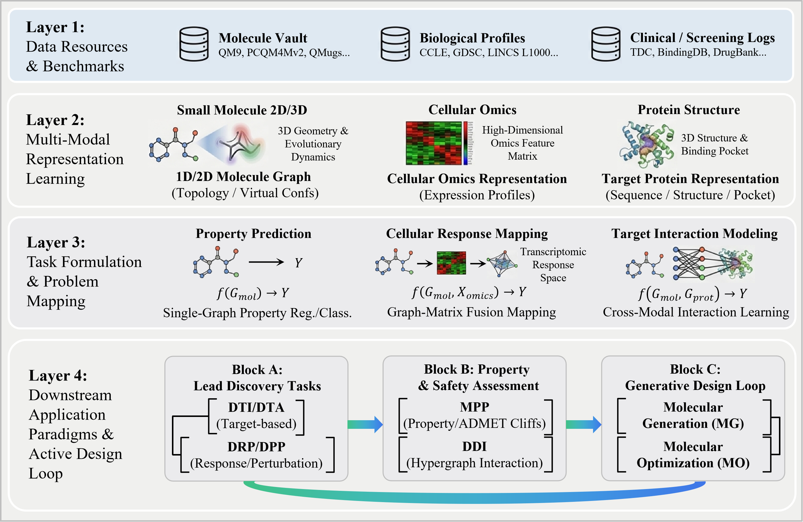

# A Comprehensive Survey on Graph-Structured Small-Molecule Drug Discovery and Development with Deep Learning
A curated paper list for graph-structured small-molecule drug discovery and development with deep learning. 
This repository follows the four-layer view of the survey: data resources and benchmarks, multi-modal representation learning, task formulation, and downstream application paradigms. 

## Table of Contents

- [Molecular Representation Learning](#molecular-representation-learning)
- [Lead Discovery Tasks](#lead-discovery-tasks)
  - [Drug-Target Interaction and Affinity Prediction](#drug-target-interaction-and-affinity-prediction-dtidta)
  - [Drug Response Prediction](#drug-response-prediction-drp)
  - [Drug Perturbation Prediction](#drug-perturbation-prediction-dpp)
- [Property and Safety Assessment](#property-and-safety-assessment)
  - [Molecular Property Prediction](#molecular-property-prediction-mpp)
  - [Drug-Drug Interaction Prediction](#drug-drug-interaction-prediction-ddi)
- [Generative Design Loop](#generative-design-loop)
  - [Molecular Generation](#molecular-generation-mg)
  - [Molecular Optimization](#molecular-optimization-mo)
- [Datasets and Benchmarks](#datasets-and-benchmarks)

## Molecular Representation Learning

Molecular representation learning has evolved from sequence and topology-centered encodings toward graph-structured representations that integrate **2D topology**, **3D geometry**, **molecular dynamics**, **electronic structure**, and **multi-modal biological context**. In this repository, representation-learning papers are organized by downstream tasks, while cross-cutting tags describe molecular inputs, model architectures, and datasets.

Suggested tags: `SMILES`, `2D graph`, `3D graph`, `E(3)/SE(3)-equivariant`, `Graph Transformer`, `molecular dynamics`, `electron density`, `omics`, `protein pocket`, `knowledge graph`, `diffusion`, and `foundation model`.

## Lead Discovery Tasks

### Drug-Target Interaction and Affinity Prediction (DTI/DTA)

DTI/DTA models estimate whether a small molecule interacts with a biological target and, in affinity settings, how strongly this interaction occurs. Recent methods move from independent drug/protein encoding and simple concatenation toward graph-based drug encoders, protein language models, pocket-aware 3D structures, attention-based fusion, knowledge-enhanced learning, and OOD generalization.

Abbreviations: 3D = three-dimensional; BAN = bilinear attention network; Concat = concatenation; Gen. = generative modeling; GN = gating network; KGE = knowledge graph embedding; MFP = molecular fingerprint; MP = message passing; PLM = protein language model; Seq. = protein sequence; SMILES = simplified molecular-input line-entry system; Trans. = Transformer.

| Year | Method | Venue | Drug | Target | Fusion | Tasks |
| --- | --- | --- | --- | --- | --- | --- |
| 2026 | **BioCG:[BioCG: Constrained Generative Modeling for Biochemical Interaction Prediction](https://proceedings.neurips.cc/paper_files/paper/2025/hash/066e4dbfeccb5dc2851acd5eca584937-Abstract-Conference.html)** | NeurIPS | SMILES | Seq. | Gen. | Classification |
| 2026 | **DrugCMF:[Bridging the Modality Reliability Gap in Drug-Target Interaction Prediction via a Confidence-aware Multimodal Fusion Framework](https://doi.org/10.1609/aaai.v40i32.39972)** | AAAI | SMILES, 3D | Seq., 3D | Attention | Classification |
| 2026 | **GRAM-DTI:[GRAM-DTI: adaptive multimodal representation learning for drug target interaction prediction](https://arxiv.org/abs/2509.21971)** | ICLR | SMILES | Seq. | Concat | Classification |
| 2026 | **LigoSpace:[Enhancing bioactivity prediction via spatial emptiness representation of protein-ligand complex and union of multiple pockets](https://proceedings.neurips.cc/paper_files/paper/2025/hash/989be684b6315b788a0cc18e2775f045-Abstract-Conference.html)** | NeurIPS | Graph, 3D | Graph, 3D | MP | Regression |
| 2025 | **DTIAM:[DTIAM: a unified framework for predicting drug-target interactions, binding affinities and drug mechanisms](https://doi.org/10.1038/s41467-025-57828-0)** | Nat. Commun. | Graph | Seq. | Concat | Classification / Regression |
| 2025 | **MoseDTI:[Blend the Separated: Mixture of Synergistic Experts for Data-Scarcity Drug-Target Interaction Prediction](https://arxiv.org/abs/2503.15796)** | AAAI | Graph | Seq. | Attention | Classification |
| 2025 | **R-DTI:[R-DTI: Drug Target Interaction Prediction Based on Second-Order Relevance Exploration](https://doi.org/10.1609/aaai.v39i16.33909)** | AAAI | SMILES, Graph | Seq., 3D | Concat | Classification |
| 2024 | **DrugCLIP:[DrugCLIP: Contrastive Protein-Molecule Representation Learning for Virtual Screening](https://openreview.net/forum?id=lAbCgNcxm7)** | NeurIPS | 3D | 3D Pocket | - | Classification |
| 2024 | **MGNDTI:[MGNDTI: A Drug-Target Interaction Prediction Framework Based on Multimodal Representation Learning and the Gating Mechanism](https://doi.org/10.1021/acs.jcim.4c00957)** | J. Chem. Inf. Model. | SMILES, Graph | Seq. | GN | Classification |
| 2024 | **MlanDTI:[Multilevel Attention Network with Semi-supervised Domain Adaptation for Drug-Target Prediction](https://doi.org/10.1609/aaai.v38i1.27786)** | AAAI | SMILES | Seq. | Attention | Classification |
| 2024 | **Otter-Knowledge:[Knowledge Enhanced Representation Learning for Drug Discovery](https://doi.org/10.1609/aaai.v38i9.28924)** | AAAI | SMILES, MFP | Seq. | Concat | Regression |
| 2024 | **PSC-CPI:[PSC-CPI: Multi-Scale Protein Sequence-Structure Contrasting for Efficient and Generalizable Compound-Protein Interaction Prediction](https://doi.org/10.1609/aaai.v38i1.27784)** | AAAI | Graph | Seq., Graph | MP | Regression |
| 2024 | **SiamDTI:[A Cross-Field Fusion Strategy for Drug-Target Interaction Prediction](https://arxiv.org/abs/2405.14545)** | arXiv | SMILES | Seq. | BAN | Classification |
| 2023 | **DrugBAN:[Interpretable bilinear attention network with domain adaptation improves drug-target prediction](https://doi.org/10.1038/s42256-022-00605-1)** | Nat. Mach. Intell. | Graph | Seq. | BAN | Classification |
| 2023 | **Perceiver-CPI:[Perceiver CPI: a nested cross-attention network for compound-protein interaction prediction](https://doi.org/10.1093/bioinformatics/btac731)** | Bioinformatics | SMILES, MFP | Seq. | Attention | Regression |
| 2022 | **APLM:[Adapting protein language models for rapid DTI prediction](https://doi.org/10.1101/2022.11.03.515084)** | bioRxiv | MFP | Seq. | Concat | Classification |
| 2022 | **Cross-interaction:[Cross-modality and self-supervised protein embedding for compound-protein affinity and contact prediction](https://doi.org/10.1093/bioinformatics/btac470)** | Bioinformatics | Graph | Seq., Graph | Concat | Classification |
| 2022 | **DTI-MGNN:[Drug-target interaction predication via multi-channel graph neural networks](https://doi.org/10.1093/bib/bbab346)** | Brief. Bioinform. | SMILES | Seq. | Attention | Classification |
| 2022 | **HyperAttentionDTI:[HyperAttentionDTI: improving drug-protein interaction prediction by sequence-based deep learning with attention mechanism](https://academic.oup.com/bioinformatics/article/38/3/655/6401997)** | Bioinformatics | SMILES | Seq. | Attention | Classification |
| 2021 | **MolTrans:[MolTrans: molecular interaction transformer for drug-target interaction prediction](https://academic.oup.com/bioinformatics/article/37/6/830/5929692)** | Bioinformatics | SMILES | Seq. | MP | Classification |
| 2020 | **Drug-VQA:[Predicting drug-protein interaction using quasi-visual question answering system](https://doi.org/10.1038/s42256-020-0152-y)** | Nat. Mach. Intell. | SMILES | Distance Map | Concat | Regression |

### Drug Response Prediction (DRP)

DRP predicts cellular sensitivity or response scores for a compound in a specific cellular context. Common outputs include cell viability, AUC, IC50, and drug sensitivity measurements. Recent DRP systems increasingly combine molecular graphs with gene expression, mutation, copy-number variation, epigenomics, biological networks, and domain adaptation or transfer learning.

Abbreviations: AUC = area under the curve; C = copy-number variation; E = gene expression; Epi = epigenomics; M = mutation; Net = biological network; No constr. = no explicit constraint; Not req. = not required; Path = pathway; R = RNA-seq; S = single-cell RNA-seq.

| Year | Method | Venue | Cell profiles | Drug | Technique | Tasks |
| --- | --- | --- | --- | --- | --- | --- |
| 2026 | **DeepSADR:[DeepSADR: Deep Transfer Learning with Subsequence Interaction and Adaptive Readout for Cancer Drug Response Prediction](https://openreview.net/forum?id=jrFJWpDZvq)** | ICLR | R | Graph | Domain Adaptation | Classification |
| 2026 | **MACB-DRP:[Multi-Level Domain Adaptation and Contrastive Domain Isolation with Bilinear Fusion for Patient Drug Response Prediction](https://doi.org/10.1609/aaai.v40i24.39048)** | AAAI | E | No constr. | Domain Adaptation | Classification |
| 2026 | **MTEGDRP:[MTEGDRP: Interpretable Molecular Self-Attention Transformer and Equivariant Graph Neural Network Based on Multi-Omics Fusion for Drug Response Prediction in Cancer Cell Lines](https://doi.org/10.1021/acs.jmedchem.5c03438)** | J. Med. Chem. | M, E, C, Epi | Graph | Supervised Learning | Regression |
| 2026 | **PAM-CDR:[PAM-CDR: Property-Aware Multi-Modal Drug Representation Learning for Accurate Cancer Drug Response Prediction](https://doi.org/10.1109/JBHI.2026.3658090)** | IEEE JBHI | M, E | Graph | Supervised Learning | Regression |
| 2025 | **PASO:[Anticancer drug response prediction integrating multi-omics pathway-based difference features and multiple deep learning techniques](https://doi.org/10.1371/journal.pcbi.1012905)** | PLOS Comput. Biol. | M, E, C, Path | Subcomponent | Supervised Learning | Regression |
| 2025 | **TransDRP:[Knowledge-guided domain adaptation model for transferring drug response prediction from cell lines to patients](https://doi.org/10.1609/aaai.v39i1.32032)** | AAAI | E | Graph | Domain Adaptation | Classification |
| 2025 | **XGDP:[Drug discovery and mechanism prediction with explainable graph neural networks](https://doi.org/10.1038/s41598-024-83090-3)** | Sci. Rep. | E | Graph | Supervised Learning | Regression |
| 2025 | **drGAT:[DRGAT: predicting drug responses via diffusion-based graph attention network](https://doi.org/10.1089/cmb.2024.0807)** | J. Comput. Biol. | E, Net | Graph | Supervised Learning | Classification |
| 2024 | **CLDR:[CLDR: Contrastive Learning Drug Response Models from Natural Language Supervision](https://arxiv.org/abs/2312.10707)** | IJCAI | No constr. | No constr. | Contrastive Learning | Regression |
| 2024 | **DIPK:[Improving drug response prediction via integrating gene relationships with deep learning](https://doi.org/10.1093/bib/bbae153)** | Brief. Bioinform. | E, Net | Graph | Pre-training | Regression |
| 2024 | **MSDA:[Zero-shot Learning of Drug Response Prediction for Preclinical Drug Screening](https://arxiv.org/abs/2310.12996)** | IJCAI | No constr. | No constr. | Domain Generalization | Regression |
| 2024 | **PREDICT-AI:[Personalised drug identifier for cancer treatment with transformers using auxiliary information](https://doi.org/10.1145/3637528.3671652)** | KDD | M | No constr. | Domain Adaptation | Classification / Regression |
| 2024 | **WISER:[WISER: Weak supervISion and supErvised Representation learning to improve drug response prediction in cancer](https://arxiv.org/abs/2405.04078)** | arXiv | E | No constr. | Weak Supervision Learning | Classification |
| 2023 | **SubCDR:[A subcomponent-guided deep learning method for interpretable cancer drug response prediction](https://doi.org/10.1371/journal.pcbi.1011382)** | PLOS Comput. Biol. | E, R | Subcomponent | Supervised Learning | Classification / Regression |
| 2022 | **CODE-AE:[A context-aware deconfounding autoencoder for robust prediction of personalized clinical drug response from cell-line compound screening](https://doi.org/10.1038/s42256-022-00541-0)** | Nat. Mach. Intell. | R | Not req. | Domain Generalization | Classification |
| 2022 | **DeepTTA:[DeepTTA: a transformer-based model for predicting cancer drug response](https://doi.org/10.1093/bib/bbac100)** | Brief. Bioinform. | E | Subcomponent | Supervised Learning | Classification |
| 2022 | **GraphCDR:[GraphCDR: a graph neural network method with contrastive learning for cancer drug response prediction](https://doi.org/10.1093/bib/bbab457)** | Brief. Bioinform. | M, E, C | Graph | Contrastive Learning | Classification |
| 2022 | **TGSA:[TGSA: protein-protein association-based twin graph neural networks for drug response prediction with similarity augmentation](https://doi.org/10.1093/bioinformatics/btab650)** | Bioinformatics | M, E, C, Net | Graph | Supervised Learning | Regression |
| 2022 | **scDEAL:[Deep transfer learning of cancer drug responses by integrating bulk and single-cell RNA-seq data](https://doi.org/10.1038/s41467-022-34277-7)** | Nat. Commun. | R, S | Not req. | Transfer Learning | Classification |
| 2019 | **Dr. VAE:[Dr. VAE: improving drug response prediction via modeling of drug perturbation effects](https://doi.org/10.1093/bioinformatics/btz158)** | Bioinformatics | E | No constr. | Supervised Learning | Regression |

### Drug Perturbation Prediction (DPP)

DPP predicts high-dimensional post-treatment cellular states, such as gene expression profiles and differential expression signatures, under chemical perturbation. Methods have evolved from autoencoder-based latent reconstruction to disentangled perturbation modeling, optimal transport, single-cell foundation models, and diffusion-based generative frameworks.

Abbreviations: AE = autoencoder; E = gene expression; GAN = generative adversarial network; MLP = multilayer perceptron; Neural OT = neural optimal transport; No constr. = no explicit constraint; S = single-cell RNA-seq; scFM = single-cell foundation model; Trans. = Transformer; VAE = variational autoencoder.

| Year | Method | Venue | Cell profiles | Drug | Cell state arch. | Technique | Tasks |
| --- | --- | --- | --- | --- | --- | --- | --- |
| 2026 | **CRISP:[Predicting drug responses of unseen cell types through transfer learning with foundation models](https://doi.org/10.1038/s43588-025-00887-6)** | Nat. Comput. Sci. | S | No constr. | scFM, VAE | Transfer Learning | Classification / Regression |
| 2026 | **DeepICER:[DeepICER: A deep learning framework for predicting compound-induced gene expression profiles](https://doi.org/10.1016/j.apsb.2026.01.046)** | Acta Pharm. Sin. B | E | Subcomponent | MLP | Supervised Learning | Regression |
| 2026 | **PertDit:[Predicting drug-perturbed transcriptional responses using multi-conditional diffusion transformer](https://doi.org/10.1002/qub2.70016)** | Quant. Biol. | E | Subcomponent | Diffusion | Supervised Learning | Regression |
| 2026 | **Squidiff:[Squidiff: predicting cellular development and responses to perturbations using a diffusion model](https://doi.org/10.1038/s41592-025-02877-y)** | Nat. Methods | S | No constr. | Diffusion | Supervised Learning | Regression |
| 2026 | **XPert:[Modelling drug-induced cellular perturbation responses with a biologically informed dual-branch transformer](https://doi.org/10.1038/s42256-025-01165-w)** | Nat. Mach. Intell. | S, E | Subcomponent | Trans. | Supervised Learning | Regression |
| 2024 | **CycleCDR:[Predicting single-cell cellular responses to perturbations using cycle consistency learning](https://doi.org/10.1093/bioinformatics/btae248)** | Bioinformatics | S | No constr. | GAN | Cycle Consistency Learning | Regression |
| 2024 | **PRNet:[Predicting transcriptional responses to novel chemical perturbations using deep generative model for drug discovery](https://doi.org/10.1038/s41467-024-53457-1)** | Nat. Commun. | E | Graph | VAE | Supervised Learning | Regression |
| 2023 | **CPA-Screen:[Predicting cellular responses to complex perturbations in high-throughput screens](https://doi.org/10.15252/msb.202211517)** | Mol. Syst. Biol. | S | No constr. | AE | Supervised Learning | Regression |
| 2023 | **CellOT:[Learning single-cell perturbation responses using neural optimal transport](https://doi.org/10.1038/s41592-023-01969-x)** | Nat. Methods | S | No constr. | Neural OT | Unsupervised Learning | Regression |
| 2022 | **ChemCPA:[Predicting cellular responses to novel drug perturbations at a single-cell resolution](https://doi.org/10.52202/068431-1937)** | NeurIPS | S | Graph | AE | Supervised Learning | Regression |
| 2021 | **CPA:[Compositional perturbation autoencoder for single-cell response modeling](https://doi.org/10.1101/2021.04.14.439903)** | bioRxiv | S | No constr. | AE | Supervised Learning | Regression |
| 2021 | **DeepCellState:[DeepCellState: An autoencoder-based framework for predicting cell type specific transcriptional states induced by drug treatment](https://doi.org/10.1371/journal.pcbi.1009465)** | PLOS Comput. Biol. | E | No constr. | AE | Unsupervised Learning | Regression |
| 2019 | **scGen:[scGen predicts single-cell perturbation responses](https://doi.org/10.1038/s41592-019-0494-8)** | Nat. Methods | S | No constr. | VAE | Unsupervised Learning | Regression |

## Property and Safety Assessment

### Molecular Property Prediction (MPP)

MPP estimates physicochemical, quantum-mechanical, pharmacokinetic, and toxicity-related properties from molecular structures. The table is split in the survey into non-pretraining and pretraining families; this repository keeps a unified sortable list with representation and architecture tags.

| Year | Method | Venue | Representation | Architecture | Tasks |
| --- | --- | --- | --- | --- | --- |
| 2026 | **UniField:[UniField: RBF-Guided Electron Density Fusion for Enhanced Molecular Representations](https://arxiv.org/abs/2605.24013)** | arXiv | 3D/ED | Trans. | Regression | 
| 2025 | **E2Former:[E2Former: An Efficient and Equivariant Transformer with Linear-Scaling Tensor Products](https://proceedings.neurips.cc/paper_files/paper/2025/hash/21f7b745f73ce0d1f9bcea7f40b1388e-Abstract-Conference.html)** | NeurIPS | 2/3D graph | GT | Regression | 
| 2025 | **EDG:[Electron Density-enhanced Molecular Geometry Learning](https://www.ijcai.org/proceedings/2025/0872.pdf)** | IJCAI | 3D/ED | KD/GNNs | Regression | 
| 2025 | **GotenNet:[GotenNet: Rethinking Efficient 3D Equivariant Graph Neural Networks](https://openreview.net/forum?id=5wxCQDtbMo)** | ICLR | 3D graph | GNNs | Regression | 
| 2025 | **MolMCL-GCN:[Multi-channel learning for integrating structural hierarchies into context-dependent molecular representation](https://www.nature.com/articles/s41467-024-55082-4)** | Nature Communications | 2D graph | GT | Classification | 
| 2025 | **SCHull:[A Theoretically-Principled Sparse, Connected, and Rigid Graph Representation of Molecules](https://proceedings.iclr.cc/paper_files/paper/2025/hash/59ac7b4faef41e5c49d4fee24f3e8fbb-Abstract-Conference.html)** | ICLR | 3D graph | GNNs | Regression | 
| 2024 | **GraphSAM:[Efficient Sharpness-Aware Minimization for Molecular Graph Transformer Models](https://openreview.net/forum?id=Od39h4XQ3Y)** | ICLR | 2D graph | GT | Classification / Regression | 
| 2024 | **HDGNN:[Hybrid Directional Graph Neural Network for Molecules](https://openreview.net/forum?id=BBD6KXIGJL)** | ICLR | 3D graph | GNNs | Regression | 
| 2024 | **JMP:[From Molecules to Materials: Pre-training Large Generalizable Models for Atomic Property Prediction](https://openreview.net/forum?id=PfPnugdxup)** | ICLR | 3D graph | GNNs | Regression |
| 2024 | **MOL-AE:[Mol-AE: Auto-Encoder Based Molecular Representation Learning With 3D Cloze Test Objective](https://openreview.net/forum?id=inEuvSg0y1)** | ICML | 3D graph | Trans. | Classification / Regression |
| 2024 | **MOLEBLEND:[Multimodal Molecular Pretraining via Modality Blending](https://proceedings.iclr.cc/paper_files/paper/2024/hash/391aae9ccaf95a3d80dde4c8408f2c91-Abstract-Conference.html)** | ICLR | 2/3D graph | Trans. | Classification / Regression |
| 2024 | **Polymer Walk:[Representing Molecules as Random Walks Over Interpretable Grammars](https://openreview.net/forum?id=gS3nc9iUrH)** | ICML | 2D graph | GNNs | Regression | 
| 2024 | **QTAIM:[High-throughput quantum theory of atoms in molecules (QTAIM) for geometric deep learning of molecular and reaction properties](https://www.sciencedirect.com/org/science/article/pii/S2635098X24000780)** | Digital Discovery | 3D graph | GNNs | Classification / Regression |
| 2024 | **SliDe:[Sliced Denoising: A Physics-Informed Molecular Pre-Training Method](https://proceedings.iclr.cc/paper_files/paper/2024/hash/4a1d69d1f64c6b6df105b15984ca527a-Abstract-Conference.html)** | ICLR | 3D graph | Trans. | Regression | 
| 2024 | **Uni-Mol+:[Data-driven quantum chemical property prediction leveraging 3D conformations with Uni-Mol+](https://www.nature.com/articles/s41467-024-51321-w)** | Nature communications | 3D graph | Trans. | Regression | 
| 2024 | **Uni-Mol2:Exploring Molecular Pretraining Model at Scale](https://proceedings.neurips.cc/paper_files/paper/2024/hash/53923bb44655a7defb31c7744c01b62b-Abstract-Conference.html)** | NeurIPS | 2D graph | Trans. | Regression | 
| 2024 | **UniCorn:[UniCorn: A Unified Contrastive Learning Approach for Multi-view Molecular Representation Learning](https://proceedings.mlr.press/v235/feng24f.html)** | ICML | 2/3D graph | Trans. | Regression | 
| 2024 | **ViSNet:[Enhancing geometric representations for molecules with equivariant vector-scalar interactive message passing](https://www.nature.com/articles/s41467-023-43720-2)** | Nature Communications | 3D graph | Trans. | Regression | 
| 2023 | **Allegro:[Learning local equivariant representations for large-scale atomistic dynamics](https://www.nature.com/articles/s41467-023-36329-y)** | Nature Communications | 1D desc. | MLP | Regression | 
| 2023 | **Equiformer:[Equiformer: Equivariant Graph Attention Transformer for 3D Atomistic Graphs](https://openreview.net/forum?id=KwmPfARgOTD)** | ICLR | 3D graph | GT | Regression | 
| 2023 | **Geo-DEG:[Hierarchical Grammar-Induced Geometry for Data-Efficient Molecular Property Prediction](https://proceedings.mlr.press/v202/guo23h.html?ref=https://giter.vip)** | PMLR | 2D graph | GNNs | Classification / Regression |
| 2023 | **Molformer:[Molformer: Motif-Based Transformer on 3D Heterogeneous Molecular Graphs ](https://ojs.aaai.org/index.php/AAAI/article/view/25662)** | AAAI | 2/3D graph | Trans. | Classification / Regression | 
| 2023 | **Transformer-M:[One Transformer Can Understand Both 2D & 3D Molecular Data](https://openreview.net/forum?id=vZTp1oPV3PC)** | ICLR | 2/3D graph | Trans. | Regression | 
| 2023 | **Uni-Mol:[Uni-Mol: A Universal 3D Molecular Representation Learning Framework](https://openreview.net/forum?id=6K2RM6wVqKu)** | ICLR | 3D graph | Trans. | Classification / Regression | 
| 2022 | **3D Infomax:[3D Infomax improves GNNs for Molecular Property Prediction](https://proceedings.mlr.press/v162/stark22a.html)** | PMLR | 2/3D graph | PNA | Regression | 
| 2022 | **GEM:[Geometry-enhanced molecular representation learning for property prediction](https://www.nature.com/articles/s42256-021-00438-4)** | Nature Machine Intelligence | 2/3D graph | GeoGNN | Classification / Regression |
| 2022 | **GeomGCL:[GeomGCL: Geometric Graph Contrastive Learning for Molecular Property Prediction](https://ojs.aaai.org/index.php/AAAI/article/view/20377)** |  AAAI  | 2/3D graph | GNNs | Classification / Regression | 
| 2022 | **GraphMAE:[GraphMAE: Self-Supervised Masked Graph Autoencoders](https://dl.acm.org/doi/abs/10.1145/3534678.3539321)** | KDD | 2D graph | GNNs | Classification |
| 2022 | **GraphMVP:Pre-training Molecular Graph Representation with 3D Geometry](https://openreview.net/forum?id=xQUe1pOKPam)** | ICLR | 2/3D graph | GNNs | Classification | 
| 2022 | **MolCLR:[Molecular contrastive learning of representations via graph neural networks](https://www.nature.com/articles/s42256-022-00447-x)** | Nature Machine Intelligence | 2D graph | GNNs | Classification / Regression | 
| 2022 | **MoleOOD:[Learning Substructure Invariance for Out-of-Distribution Molecular Representations](https://proceedings.neurips.cc/paper_files/paper/2022/hash/547108084f0c2af39b956f8eadb75d1b-Abstract-Conference.html)** | NeurIPS | 2D graph | GNNs | Classification |
| 2022 | **SphereNet:[Spherical Message Passing for 3D Molecular Graphs](https://openreview.net/forum?id=givsRXsOt9r)** | ICLR | 3D graph | GNNs | Regression |
| 2022 | **TorchMD-Net:[TorchMD: A Deep Learning Framework for Molecular Simulations](https://pubs.acs.org/doi/full/10.1021/acs.jctc.0c01343)** | ICLR | 3D graph | Trans. | Regression | 
| 2021 | **PaiNN:[Equivariant message passing for the prediction of tensorial properties and molecular spectra](https://proceedings.mlr.press/v139/schutt21a.html?ref=https://githubhelp.com)** | PMLR | 3D graph | MPNN | Regression | 
| 2020 | **DimeNet:[Directional Message Passing for Molecular Graphs](https://openreview.net/forum?id=B1eWbxStPH)** | ICLR | 3D graph | GNNs | Regression | 
| 2020 | **InfoGraph:[InfoGraph: Unsupervised and Semi-supervised Graph-Level Representation Learning via Mutual Information Maximization](https://openreview.net/forum?id=r1lfF2NYvH)** | ICLR | 2D graph | GIN | Regression |

**Architectures : Graph Neural Networks (GNNs), Message Passing Neural Networks (MPNN), Graph Transformer (GT), Transformer (Trans.)**

### Drug-Drug Interaction Prediction (DDI)

DDI prediction models synergistic effects, antagonistic interactions, and adverse events induced by combinations of drugs. Recent approaches incorporate graph neural networks, knowledge graphs, contrastive learning, causal inference, reinforcement learning, neural architecture search, and language-model-assisted reasoning.

Abbreviations: 2D = two-dimensional; CL = contrastive learning; GIB = graph information bottleneck; GNN = graph neural network; GNNs = graph neural networks; IGIB = interaction graph information bottleneck; KG = knowledge graph; LLMs = large language models; MI = mutual information; NAS = neural architecture search; NLG = natural language generation; RL = reinforcement learning; SEL = semantic enhanced learning; SMILES = simplified molecular-input line-entry system; SSL = self-supervised learning; SSP = structural similarity profile; Trans. = Transformer.

| Year | Method | Venue | Drug | Technique | Tasks |
| --- | --- | --- | --- | --- | --- |
| 2026 | **PC-DDI:[Closer to Biological Mechanism: Drug-Drug Interaction Prediction from the Perspective of Pharmacophore](https://doi.org/10.1609/aaai.v40i25.39229)** | AAAI | Graph | GNNs, Causal | Multi-class |
| 2026 | **RISE-DDI:[Informative Subgraph Extraction with Deep Reinforcement Learning for Drug-Drug Interaction Prediction](https://doi.org/10.1609/aaai.v40i2.37105)** | AAAI | Graph | GNNs, RL | Multi-class |
| 2026 | **S2VM:[Self-supervised Blending Structural Context of Visual Molecules for Robust Drug Interaction Prediction](https://proceedings.neurips.cc/paper_files/paper/2025/hash/c0ebffad509ae02bd60340690b1fdd5d-Abstract-Conference.html)** | NeurIPS | 2D Image | Trans., SSL | Multi-class |
| 2025 | **ExDDI:[ExDDI: Explaining Drug-Drug Interaction Predictions with Natural Language](https://doi.org/10.1609/aaai.v39i24.34709)** | AAAI | SMILES, Text | Trans., NLG | Classification / Generation |
| 2025 | **K-Paths:[K-Paths: Reasoning over Graph Paths for Drug Repurposing and Drug Interaction Prediction](https://doi.org/10.1145/3711896.3737011)** | KDD | KG Entity | Path, LLMs, GNNs | Multi-class |
| 2025 | **MOTOR:[Motif-Oriented Representation Learning with Topology Refinement for Drug-Drug Interaction Prediction](https://doi.org/10.1609/aaai.v39i1.32097)** | AAAI | Graph | GNNs, Motif | Multi-class |
| 2025 | **MolecBioNet:[Towards Interpretable Drug-Drug Interaction Prediction: A Graph-Based Approach with Molecular and Network-Level Explanations](https://doi.org/10.1145/3711896.3737163)** | KDD | Graph | GNNs, KG, Pooling, MI | Multi-class |
| 2025 | **PHGL-DDI:[PHGL-DDI: A pre-training based hierarchical graph learning framework for drug-drug interaction prediction](https://doi.org/10.1016/j.eswa.2025.126408)** | Expert Syst. Appl. | Graph | CL | Multi-class |
| 2024 | **CSSE-DDI:[Customized Subgraph Selection and Encoding for Drug-drug Interaction Prediction](https://doi.org/10.52202/079017-3478)** | NeurIPS | Graph | GNNs, NAS | Multi-class |
| 2024 | **MKG-FENN:[MKG-FENN: A Multimodal Knowledge Graph Fused End-to-End Neural Network for Accurate Drug-Drug Interaction Prediction](https://doi.org/10.1609/aaai.v38i9.28887)** | AAAI | SMILES | KG | Multi-class |
| 2024 | **TIGER:[Dual-Channel Learning Framework for Drug-Drug Interaction Prediction via Relation-Aware Heterogeneous Graph Transformer](https://doi.org/10.1609/aaai.v38i1.27777)** | AAAI | Graph | GNN | Multi-class |
| 2024 | **ZeroDDI:[ZeroDDI: A Zero-Shot Drug-Drug Interaction Event Prediction Method with Semantic Enhanced Learning and Dual-Modal Uniform Alignment](https://arxiv.org/abs/2407.00891)** | arXiv | SMILES | SEL | Recommendation |
| 2023 | **CGIB:[Conditional graph information bottleneck for molecular relational learning](https://proceedings.mlr.press/v202/lee23e.html)** | ICML | Graph | GIB | Multi-class Regression |
| 2023 | **DANN-DDI:[Enhancing Drug-Drug Interaction Prediction Using Deep Attention Neural Networks](https://doi.org/10.1109/TCBB.2022.3172421)** | IEEE/ACM TCBB | Graph | Attention | Multi-class |
| 2023 | **IGIB-ISE:[Conditional graph information bottleneck for molecular relational learning](https://proceedings.mlr.press/v202/lee23e.html)** | ICML | Graph | IGIB | Multi-class Regression |
| 2022 | **DDKG:[Attention-based Knowledge Graph Representation Learning for Predicting Drug-drug Interactions](https://doi.org/10.1093/bib/bbac140)** | Brief. Bioinform. | SMILES, Graph | KG | Multi-class |
| 2021 | **CSGNN:[CSGNN: Contrastive Self-Supervised Graph Neural Network for Molecular Interaction Prediction](https://doi.org/10.24963/ijcai.2021/517)** | IJCAI | Graph | CL | Classification |
| 2020 | **BI-GNN:[Bi-Level Graph Neural Networks for Drug-Drug Interaction Prediction](https://arxiv.org/abs/2006.14002)** | arXiv | Graph | GNN | Multi-class |
| 2020 | **GoGNN:[GoGNN: Graph of Graphs Neural Network for Predicting Structured Entity Interactions](https://arxiv.org/abs/2005.05537)** | arXiv | Graph | GNN | Classification |
| 2018 | **DeepDDI:[Deep learning improves prediction of drug-drug and drug-food interactions](https://doi.org/10.1073/pnas.1803294115)** | PNAS | SMILES, Text | SSP | Multi-class |

## Generative Design Loop

### Molecular Generation (MG)

MG aims to generate novel chemically valid molecules under unconditional or conditional design objectives. To keep the GitHub table readable, the long mathematical backbones from the survey are summarized as compact method categories, conditioning signals, and design focuses.

| Year | Method | Venue | Category | Condition | Design focus | 
| --- | --- | --- | --- | --- | --- |
| 2026 | **Apo2Mol:[Apo2Mol: 3D Molecule Generation via Dynamic Pocket-Aware Diffusion Models](https://ojs.aaai.org/index.php/AAAI/article/view/37138)** | AAAI | Diffusion | Protein pocket | Molecular generation based on Diffusion with condition: Protein. | 
| 2025 | **LDMol:[LDMol: A Text-to-Molecule Diffusion Model with Structurally Informative Latent Space Surpasses AR Models](https://proceedings.mlr.press/v267/chang25d.html)** | ICML | Diffusion | Text | Molecular generation based on Diffusion with condition: Text. | 
| 2025 | **RxnFlow:[Generative Flows on Synthetic Pathway for Drug Design](https://proceedings.iclr.cc/paper_files/paper/2025/hash/24d36eee157559e0d2549455fba28f6a-Abstract-Conference.html)** | ICLR | GFlowNet | Protein + synthesis | Molecular generation based on GFlowNet with condition: Protein. | 
| 2025 | **SynFlowNet:[SynFlowNet: Design of Diverse and Novel Molecules with Synthesis Constraints](https://proceedings.iclr.cc/paper_files/paper/2025/hash/7495fa446f10e9edef6e47b2d327596e-Abstract-Conference.html)** | ICLR | GFlowNet | Synthesis | GFlowNet molecular design with explicit synthesis constraints. | 
| 2024 | **GraphDiT:[Graph Diffusion Transformers for Multi-Conditional Molecular Generation](https://proceedings.neurips.cc/paper_files/paper/2024/hash/0f6931a9e339a012a9909306d7c758b4-Abstract-Conference.html)** | NeurIPS | Diffusion Transformer | Property | Molecular generation based on Diffusion with condition: Property. |
| 2023 | **DecompDiff:[DecompDiff: Diffusion Models with Decomposed Priors for Structure-Based Drug Design](https://openreview.net/forum?id=9qy9DizMlr)** | ICML | Diffusion | Protein pocket | Molecular generation based on Diffusion with condition: Protein. | 
| 2023 | **GeoLDM:[Geometric Latent Diffusion Models for 3D Molecule Generation](https://proceedings.mlr.press/v202/xu23n.html)** | ICML | Diffusion | 3D geometry | Molecular generation based on Diffusion with condition: --. |
| 2023 | **MOOD:[Exploring Chemical Space with Score-based Out-of-distribution Generation](https://proceedings.mlr.press/v202/lee23f.html)** | ICML | Diffusion | Property / OOD | Molecular generation based on Diffusion with condition: Property. | 
| 2023 | **MolHF:[MolHF: a hierarchical normalizing flow for molecular graph generation](https://dl.acm.org/doi/abs/10.24963/ijcai.2023/556)** | IJCAI | Flow | Property | Molecular generation based on Flow with condition: Property. | 
| 2022 | **3DLinker:[3DLinker: An E(3) Equivariant Variational Autoencoder for Molecular Linker Design](https://proceedings.mlr.press/v162/huang22g.html)** | ICML | VAE | Fragment/linker | Molecular generation based on VAE with condition: --. | 
| 2022 | **GDSS:[Score-based Generative Modeling of Graphs via the System of Stochastic Differential Equations](https://proceedings.mlr.press/v162/jo22a.html)** | ICML | Diffusion | Unconditional | Molecular generation based on Diffusion with condition: --. | 
| 2022 | **TransORGAN:[Transformer-Based Objective-Reinforced Generative Adversarial Network to Generate Desired Molecules](https://doi.org/10.24963/ijcai.2022/539)** | IJCAI | GAN | Property | Molecular generation based on GAN with condition: Property. | 
| 2021 | **CGCF:[Learning Neural Generative Dynamics for Molecular Conformation Generation](https://arxiv.org/abs/2102.10240)** | arXiv | Flow | Conformation | Molecular generation based on Flow with condition: --. | 
| 2021 | **GF-VAE:[GF-VAE: A Flow-based Variational Autoencoder for Molecule Generation](https://dl.acm.org/doi/abs/10.1145/3459637.3482260)** | CIKM | Flow | Property | Flow-based variational autoencoder for molecular graph generation. | 
| 2019 | **LatentGAN:[A de novo molecular generation method using latent vector based generative adversarial network](https://link.springer.com/article/10.1186/s13321-019-0397-9)** | Journal of Cheminformatics | GAN | Unconditional | Molecular generation based on GAN with condition: --. | 

### Molecular Optimization (MO)

MO improves existing lead compounds while preserving desirable structural characteristics. The table emphasizes optimization strategy, conditioning signal, and practical design focus instead of displaying long formulas, making the GitHub view more compact and consistent.

| Year | Method | Venue | Category | Condition | Design focus |
| --- | --- | --- | --- | --- | --- |
| 2026 | **SMER-Opt:[From Single-Step Edit Response to Multi-Step Molecular Optimization](https://doi.org/10.48550/arXiv.2605.10035)** | arXiv | Editing / Search | Property | Sequential molecular editing from single-step edit-response modeling. | 
| 2025 | **CombiMOTS:[CombiMOTS: Combinatorial Multi-Objective Tree Search for Dual-Target Molecule Generation](https://proceedings.mlr.press/v267/southiratn25a.html)** | ICML | Pareto MCTS | Dual targets / properties | Molecular optimization based on Pareto MCTS with condition: Proteins. | 
| 2025 | **[Enhancing Ligand Validity and Affinity in Structure-Based Drug Design with Multi-Reward Optimization](https://openreview.net/forum?id=gmFeso9sXJ)** | ICML | Reward optimization | Protein pocket | Molecular optimization based on Reward Optimization with condition: Protein. | 
| 2025 | **MolEditRL:[MolEditRL: Structure-Preserving Molecular Editing via Discrete Diffusion and Reinforcement Learning](https://arxiv.org/abs/2505.20131)** | arXiv | Editing + RL | Property | Molecular optimization based on Editing with condition: Property. | 
| 2025 | **MolJO:[Empower Structure-Based Molecule Optimization with Gradient Guided Bayesian Flow Networks](https://proceedings.mlr.press/v267/qiu25h.html)** | ICML | Gradient-guided BFN | Protein pocket | Molecular optimization based on Gradient with condition: Protein. |
| 2025 | **VOS:[Piloting Structure-Based Drug Design via Modality-Specific Optimal Schedule](https://proceedings.mlr.press/v267/qiu25g.html)** | ICML | Schedule optimization | Protein pocket | Molecular optimization based on Schedule Optimization with condition: Protein. | 
| 2024 | **DecompOpt:[DecompOpt: Controllable and Decomposed Diffusion Models for Structure-based Molecular Optimization](https://openreview.net/forum?id=Y3BbxvAQS9)** | ICLR | Diffusion | Protein pocket | Molecular optimization based on Diffusion with condition: Protein. | 
| 2024 | **DyMol:[Dynamic Many-Objective Molecular Optimization: Unfolding Complexity with Objective Decomposition and Progressive Optimization](https://openreview.net/pdf?id=pmfub8rn4W)** |IJCAI | Search | Dynamic many-objective | Molecular optimization based on Search with condition: Property. | 
| 2024 | **FMOP:[Fragment-Masked Diffusion for Molecular Optimization](https://arxiv.org/abs/2408.09106)** | arXiv | Diffusion | Cell response | Molecular optimization based on Diffusion with condition: Cell. | 
| 2024 | **HN-GFN:[Sample-efficient Multi-objective Molecular Optimization with GFlowNets](https://proceedings.neurips.cc/paper_files/paper/2023/hash/fbc9981dd6316378aee7fd5975250f21-Abstract-Conference.html)** | NeurIPS | GFlowNet / Search | Multi-objective property | Sample-efficient multi-objective molecular optimization with GFlowNets. | 
| 2024 | **PMDM:[A dual diffusion model enables 3D molecule generation and lead optimization based on target pockets](https://www.nature.com/articles/s41467-024-46569-1)** | Nature Communications | Diffusion | Protein pocket | Molecular optimization based on Diffusion with condition: Protein. |
| 2024 | **Prompt-MolOpt:[Leveraging language model for advanced multiproperty molecular optimization via prompt engineering](https://www.nature.com/articles/s42256-024-00916-5)** | Nature Machine Intelligence | AutoReg / Prompt LM | Property | Prompt-engineered language-model framework for multiproperty molecular optimization. | 
| 2022 | **MolSearch:[MolSearch: Search-based Multi-objective Molecular Generation and Property Optimization](https://dl.acm.org/doi/abs/10.1145/3534678.3542676)** | SIGKDD | Search | Multi-objective property | Molecular optimization based on Search with condition: Property. | 
| 2021 | **MolEvol:[Molecule Optimization by Explainable Evolution](https://openreview.net/forum?id=jHefDGsorp5)** | ICLR | Search | Property | Molecular optimization based on Search with condition: Property. | 
| 2020 | **Mol-CycleGAN:[Mol-CycleGAN: a generative model for molecular optimization](https://link.springer.com/article/10.1186/s13321-019-0404-1)** | Journal of Cheminformatics | GAN | Property | CycleGAN-based molecular optimization preserving structural similarity. |
| 2018 | **JTVAE:[Junction Tree Variational Autoencoder for Molecular Graph Generation](https://proceedings.mlr.press/v80/jin18a)** | ICML| VAE | Property | Molecular optimization based on VAE with condition: Property. |

## Datasets and Benchmarks

The benchmark table is grouped by source collection or downstream task. `Classification` and `Regression` indicate the main prediction objective used in the survey table. Dataset statistics follow the survey draft and should be checked against the latest dataset releases when reproducing experiments.

### TDC Datasets

| Dataset | Data structure | Task type | Scale / statistics | Source |
| --- | --- | --- | --- | --- |
| BindingDB | Drug--Target | Regression | 2,701,247 | [Link](https://tdcommons.ai) |
| DAVIS | Drug--Target | Regression | 30,056 | [Link](https://tdcommons.ai) |
| KIBA | Drug--Target | Regression | 118,254 | [Link](https://tdcommons.ai) |
| DrugBank | Drug--Drug | Classification | 191,808 | [Link](https://tdcommons.ai) |
| TWOSIDES | Drug--Drug | Classification | 4,651,131 | [Link](https://tdcommons.ai) |
| GDSCv1 | Drug--Cell | Regression | 177,310 | [Link](https://tdcommons.ai) |
| GDSCv2 | Drug--Cell | Regression | 92,703 | [Link](https://tdcommons.ai) |

### TUDataset

| Dataset | Data structure | Task type | Scale / statistics | Source |
| --- | --- | --- | --- | --- |
| QM9 | Drug(QM, 3D) | Regression | 133,885 | [Link](https://chrsmrrs.github.io/datasets/) |
| ZINC | Drug(QM) | Regression | 249,456 | [Link](https://chrsmrrs.github.io/datasets/) |

### Open Graph Benchmark

| Dataset | Data structure | Task type | Scale / statistics | Source |
| --- | --- | --- | --- | --- |
| HIV | Drug(Bio.) | Classification | 41,913 | [Link](https://ogb.stanford.edu) |
| Tox21 | Drug(Physio.) | Classification | 8,014 | [Link](https://ogb.stanford.edu) |
| ToxCast | Drug(Physio.) | Classification | 8,615 | [Link](https://ogb.stanford.edu) |
| BBBP | Drug(Physio.) | Classification | 2,053 | [Link](https://ogb.stanford.edu) |
| PCQM4Mv2 | Drug(QM) | Regression | 3,746,619 | [Link](https://ogb.stanford.edu/docs/lsc/pcqm4mv2/) |

### MoleculeNet

| Dataset | Data structure | Task type | Scale / statistics | Source |
| --- | --- | --- | --- | --- |
| PCBA | Drug(Bio.) | Classification | 439,863 | [Link](https://moleculenet.org) |
| MUV | Drug(Bio.) | Classification | 93,127 | [Link](https://moleculenet.org) |
| BACE | Drug(Bio.) | Classification | 1,522 | [Link](https://moleculenet.org) |
| PDBbind | Drug(Bio.) | Regression | 11,908 | [Link](https://moleculenet.org) |
| SIDER | Drug(Physio.) | Classification | 1,427 | [Link](https://moleculenet.org) |
| ClinTox | Drug(Physio.) | Classification | 1,491 | [Link](https://moleculenet.org) |
| QM7 | Drug(QM, 3D) | Regression | 7,165 | [Link](https://moleculenet.org) |
| QM7b | Drug(QM, 3D) | Regression | 7,210 | [Link](https://moleculenet.org) |
| QM8 | Drug(QM, 3D) | Regression | 21,786 | [Link](https://moleculenet.org) |
| ESOL | Drug(Phys. Chem.) | Regression | 1,128 | [Link](https://moleculenet.org) |
| FreeSolv | Drug(Phys. Chem.) | Regression | 643 | [Link](https://moleculenet.org) |
| Lipophilicity | Drug(Phys. Chem.) | Regression | 4,200 | [Link](https://moleculenet.org) |

### Molecular Property Prediction

| Dataset | Data structure | Task type | Scale / statistics | Source |
| --- | --- | --- | --- | --- |
| MD17/22 | Drug(QM) | Regression | 99k--627k / 5k--85k | [Link](http://www.sgdml.org) |
| OC20/22 | Drug(QM) | Regression | 1,281,040 / 62,331 | [Link](https://fair-chem.github.io/index.html) |
| Molecule3D | Drug(QM) | Regression | 3,899,647 | [Link](https://github.com/divelab/MoleculeX) |
| 3BPA | Drug(QM) | Regression | 500 | [Link](https://service.tib.eu/ldmservice/dataset/3bpa-dataset) |
| ANI-1 | Drug(QM) | Regression | 24,416,306 | [Link](https://materials.colabfit.org/id/DS_p4evspy1ntcs_0) |
| QM9-ED | Drug(QM) | Regression | 133,885 | [Link](https://huggingface.co/datasets/Stephen301123/UniField-ED) |
| QMugs-ED | Drug(QM) | Regression | 50,000 | [Link](https://huggingface.co/datasets/Stephen301123/UniField-ED) |

### DTI/DTA

| Dataset | Data structure | Task type | Scale / statistics | Source |
| --- | --- | --- | --- | --- |
| LIT-PCBA | Drug--Target | Classification | 415,225 / 15 | [Link](https://drugdesign.unistra.fr/LIT-PCBA/) |
| C.elegans | Drug--Target | Classification | 1,434 / 2,504 | [Link](https://snap.stanford.edu/data/C-elegans-frontal.html) |
| Human | Drug--Target | Classification | 1,052 / 852 | [Link](https://github.com/peizhenbai/DrugBAN/tree/main/datasets) |
| DUD-E | Drug--Target | Classification | 22,886 / 102 | [Link](https://dude.docking.org/) |
| Metz | Drug--Target | Regression | 1,423 / 170 | [Link](https://service.tib.eu/ldmservice/dataset/metz) |
| Karimi | Drug--Target | Regression | 3,672 / 1,287 | [Link](https://drive.google.com/file/d/1_iZ8B1JZkCKmKlQNewOCr3kbnWfAIc-r/view) |
| BioSNAP | Drug--Target | Regression | 4,510 / 2,481 | [Link](https://snap.stanford.edu/biodata/datasets/10002/10002-ChG-Miner.html) |

### DDI

| Dataset | Data structure | Task type | Scale / statistics | Source |
| --- | --- | --- | --- | --- |
| DRUGCOMBO | Drug--Drug | Classification | 3,242 / 49,392 | [Link](https://drive.google.com/file/d/1_iZ8B1JZkCKmKlQNewOCr3kbnWfAIc-r/view) |
| KEGG | Drug--Drug | Classification | 1,295 / 56,983 | [Link](https://www.genome.jp/kegg/) |
| SIDER | Drug--Drug | Classification | 1,430 / 139,756 | [Link](http://sideeffects.embl.de/) |
| ChCh-Miner | Drug--Drug | Classification | 1,322 / 48,514 | [Link](https://snap.stanford.edu/biodata/datasets/10001/10001-ChCh-Miner.html) |
| Ogbl-biokg | Drug--Drug | Classification | 808 / 111,520 | [Link](https://ogb.stanford.edu/docs/linkprop/) |
| ZhangDDI | Drug--Drug | Regression | 548 / 48,548 | [Link](https://github.com/zw9977129/drug-drug-interaction/tree/master/dataset) |

### DRP

| Dataset | Data structure | Task type | Scale / statistics | Source |
| --- | --- | --- | --- | --- |
| CCLE | Drug--Cell | Regression | 24 / 479 | [Link](https://sites.broadinstitute.org/ccle) |
| NCI-60 | Drug--Cell | Regression | 50,000 / 60 | [Link](https://dtp.cancer.gov/discovery_development/nci-60/) |
| CTRPv2 | Drug--Cell | Regression | 494 / 720 | [Link](https://zenodo.org/records/15258883) |
| gCSI | Drug--Cell | Regression | 16 / 312 | [Link](https://zenodo.org/records/15258883) |

### DPP

| Dataset | Data structure | Task type | Scale / statistics | Source |
| --- | --- | --- | --- | --- |
| LINCS L1000 | Drug--Cell | Regression | 175,549 / 82 | [Link](https://github.com/Perturbation-Response-Prediction/PRnet) |
| Sci-Plex 3 | Drug--Cell | Regression | 188 / 3 | [Link](https://github.com/Perturbation-Response-Prediction/PRnet) |
| PBMCs | Drug--Cell | Regression | 144 / 6 | [Link](https://www.kaggle.com/competitions/open-problems-single-cell-perturbations/data) |
| CMap | Drug--Cell | Regression | 164 / 5 | [Link](https://clue.io) |

